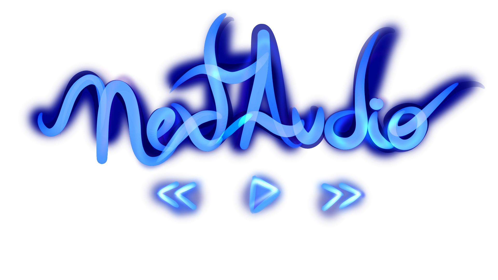

  

## NextAudio Documentation

NextAudio is a library focused in audio operations like encoding, decoding, muxing, demuxing, resampling, etc.

It's designed to be to simple to use, but with streaming support and high performance.

## Getting Started
If this is your first time using NextAudio, proceed to the [Introduction](/articles/introduction.html) in articles section.

If you wanna see all objects provided by this library you can access the [API Documentation](/api).

## Features

#### Basic features
- High performance, low memory allocation with `Span<T>`, `Memory<T>`, `ArrayPool` and lower GC pressure with `ValueTask`.
- Fully Sync and Async support.
- Per audio frame reading/writing.
- Logging with `Microsoft.Extensions.Logging`.
- Symbols debugging (`.snupkg`).

#### Containers demuxing support:
- Matroska (.mkv/.webm)

# Goals
OBS: Goals will change as new lib versions come out.

#### Audio stream providers support:
- File (current supported by `AudioStream.CreateFromFile`)
- Http (current supported by `AudioStream.CreateFromUrl`)
- Youtube

#### Containers demuxing support:
- Ogg (.ogg/.ogv/.oga/.ogx)
- Wav (.wav/.wave)
- MPEG-4 Part 14 (.mp4)
- Flac (.flac)

#### Decoders support:
- Opus (.opus)
- Vorbis (.ogg/.oga)
- AAC (.m4a/.m4b/.m4p/.m4v/.m4r/.aac/.3gp/.mp4)
- MPEG-1/2 Audio Layer 3 (.mp3/.mp4)

#### Encoders support:
- Opus (.opus)

#### Containers probe support:
- Matroska (.mkv/.webm)
- Ogg (.ogg/.ogv/.oga/.ogx)
- Wav (.wav/.wave)
- MPEG-4 Part 14 (.mp4)
- Flac (.flac)

#### Others audio operations
- Seeking (by timestamp)
- Volume
- Resampling
- Mono to Stereo

#### Others
- Package with all lib individual components
- Audio Pipelines (less complexity when wanna a specific output format)
- Support for `Microsoft.Extensions.DependencyInjection`
- Writing to output formats (`PipelineWriter`/`Stream`)
- An Audio Player structure to control play/queue/pause/seek/volume operations

## Source and License
NextAudio is licensed under [MIT License](https://github.com/NextAudio/NextAudio/blob/main/LICENSE).

The repository containing the source code for this library is in [Github](https://github.com/NextAudio/NextAudio).

NextAudio is built by [renanrcp](https://github.com/renanrcp).
